# TimerBetterer

A countdown timer for Pebble smartwatches, forked from Pebble's `pebble-timer` app.

## Features

- Choose your own accent color
- Sort timers by duration or creation
- Pause or start a timer on create
- Extra confirmation to avoid accidental deletions
- Disable grouping
- Mix and match settings

## Preview

Pebble Time 2

| Detail | List | Settings | Options | Accent Color |
| ------ | ---- | -------- | ------- | ------------ |
| 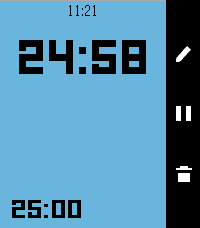 | 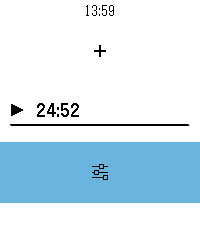 | 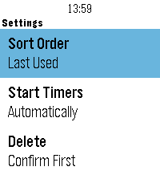 | 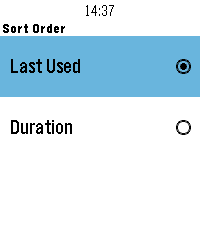 | 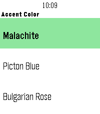 |

Pebble 2 Duo

| Detail | List | Settings | Options | Accent Color |
| ------ | ---- | -------- | ------- | ------------ |
| 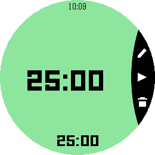 | 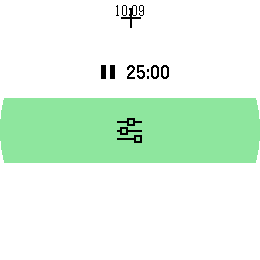 | 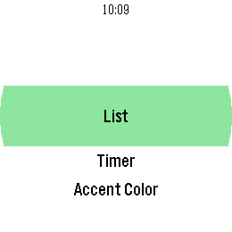 | 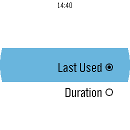 | 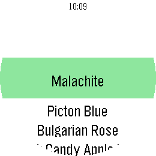 |

Pebble 2

| Detail | List | Settings | Options |
| ------ | ---- | -------- | ------- |
| 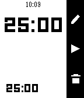 | 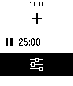 | 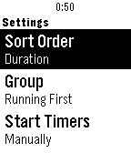 | 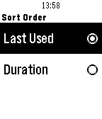 |

Pebble Time Round

| Detail | List | Settings | Options | Accent Color |
| ------ | ---- | -------- | ------- | ------------ |
| 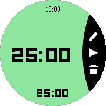 | 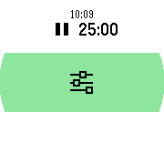 | 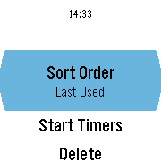 | 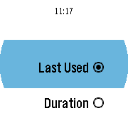 | 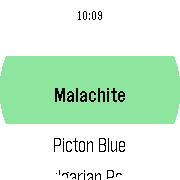 |

Pebble Time / Time Steel

| Detail | List | Settings | Options | Accent Color |
| ------ | ---- | -------- | ------- | ------------ |
| 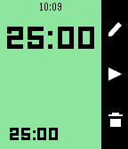 | 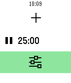 | 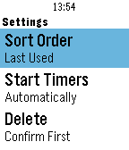 | 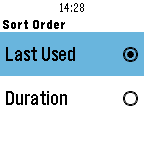 | 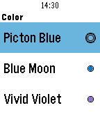 |

Pebble / Pebble Steel

| Detail | List | Flipped |
| ------ | ---- | ------- |
| 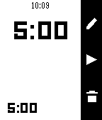 | 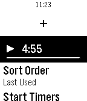 | 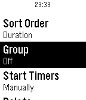 |

## Getting Started

Requires Python — `uv` or `pipx` keep the Pebble tool off the system Python.

1. Clone: `git clone https://github.com/blakegearin/timer-betterer.git && cd timer-betterer`
2. Install the community Pebble tool, which provides `pebble` on PATH: `uv tool install pebble-tool`
3. Install an SDK, which brings its own arm toolchain and emulator: `pebble sdk install 4.33.1`
4. Build for all six platforms, into `build/`: `pebble build`
5. Run it on an emulator: `pebble install --emulator basalt` — or `aplite|basalt|chalk|diorite|emery|gabbro`

## Credits

- Fork of [pebble/pebble-timer](https://github.com/pebble/pebble-timer),
  originally by Eric Phillips for Pebble
- The settings-row icon is `Pebble_25x25_Settings.svg` from
  [pebble-dev/iconography](https://github.com/pebble-dev/iconography)
  (Apache 2.0), as are the 80×80 Timeline-pin drawings
